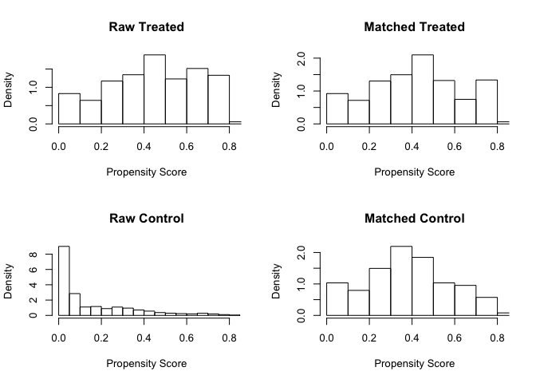
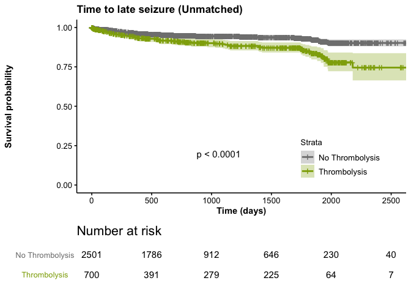
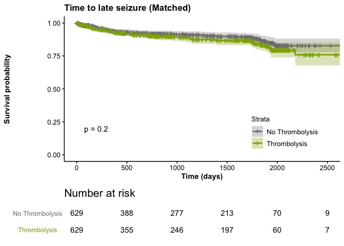
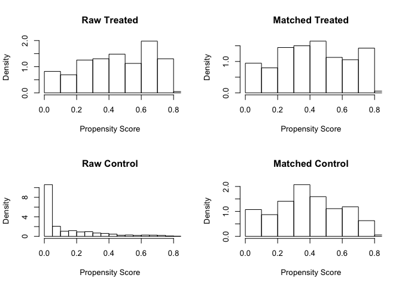
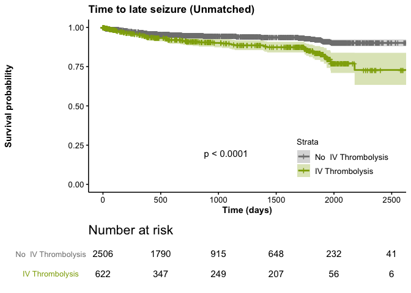
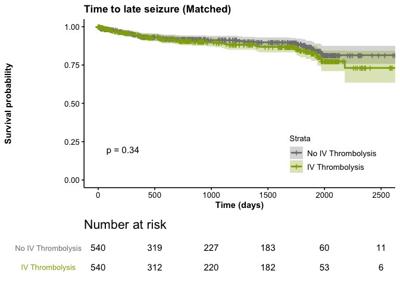

SeLECT Thrombolysis
================
Authors:

-   [Download libraries](#download-libraries)
-   [Load Data and Handle Missings (Multiple Imputation)](#load-data-and-handle-missings-multiple-imputation)
-   [Thrombolysis](#thrombolysis)
    -   [Table One](#table-one)
    -   [Unmatched data](#unmatched-data)
    -   [Matched data](#matched-data)
        -   [Examine matching performance](#examine-matching-performance)
    -   [Analysis](#analysis)
        -   [Time to first seizure unmatched data](#time-to-first-seizure-unmatched-data)
        -   [Time to first seizure matched data](#time-to-first-seizure-matched-data)
        -   [Time to late seizure unmatched data](#time-to-late-seizure-unmatched-data)
        -   [Time to late seizure matched data](#time-to-late-seizure-matched-data)
-   [IV Thrombolysis](#iv-thrombolysis)
    -   [Unmatched data](#unmatched-data-1)
    -   [Matched data](#matched-data-1)
        -   [Examine matching performance](#examine-matching-performance-1)
    -   [Analysis](#analysis-1)
        -   [Time to first seizure unmatched data](#time-to-first-seizure-unmatched-data-1)
        -   [Time to first seizure matched data](#time-to-first-seizure-matched-data-1)
        -   [Time to late seizure unmatched data](#time-to-late-seizure-unmatched-data-1)
        -   [Time to late seizure matched data](#time-to-late-seizure-matched-data-1)

### Download libraries

``` r
library(survminer)
library(survival)
library(readxl)
library(MatchIt)
library(stddiff)
library(tableone)
library(mice)
library(VIM)
library(table1)
library(pROC)
library(sensitivity)
```

### Load Data and Handle Missings (Multiple Imputation)

``` r
datawithmissings <- read_excel("data_for_analysis.xlsx")
tempdata <- mice(datawithmissings, m = 5, maxit = 50, meth = 'pmm', seed = 500, printFlag = FALSE)
```

    ## Warning: Number of logged events: 251

``` r
data <- complete(tempdata,1)
```

Thrombolysis
============

Table One
---------

``` r
data2 <- data

data2$male <- 
  factor(data2$male, levels=c(0,1),
         labels=c("Female ", 
                  "Male"))
 
data2$nihss_middle <- 
  factor(data2$nihss_middle, levels=c(0,1),
         labels=c("No", 
                  "Yes"))
data2$nihss_high <- 
  factor(data2$nihss_high, levels=c(0,1),
         labels=c("No", 
                  "Yes"))
data2$macro <- 
  factor(data2$macro, levels=c(0,1),
         labels=c("No", 
                  "Yes"))
data2$micro <- 
  factor(data2$micro, levels=c(0,1),
         labels=c("No", 
                  "Yes"))
data2$cortical <- 
  factor(data2$cortical, levels=c(0,1),
         labels=c("No", 
                  "Yes"))
data2$mca <- 
  factor(data2$mca, levels=c(0,1),
         labels=c("No", 
                  "Yes"))
data2$thrombolysis <- 
  factor(data2$thrombolysis, levels=c(0,1),
         labels=c("No thrombolysis", 
                  "Thrombolysis"))
data2$iv_thrombolysis <- 
  factor(data2$iv_thrombolysis, levels=c(0,1),
         labels=c("No", 
                  "Yes"))
data2$ia_thrombolysis <- 
  factor(data2$ia_thrombolysis, levels=c(0,1),
         labels=c("No", 
                  "Yes"))

data2$early <- 
  factor(data2$early, levels=c(0,1),
         labels=c("No", 
                  "Yes"))
data2$early_treatment <- 
  factor(data2$early_treatment, levels=c(0,1),
         labels=c("No", 
                  "Yes"))
data2$los <- 
  factor(data2$los, levels=c(0,1),
         labels=c("No late seizures", 
                  "Late seizures"))


label(data2$male)   <- "Sex"
label(data2$age)   <- "Age"
label(data2$source)   <- "Cohort"
label(data2$nihss_middle)    <- "NIHSS Middle"
label(data2$nihss_high) <- "NIHSS High"
label(data2$macro)   <- "Large-artery artherosclerosis(embolus/thrombosis)"
label(data2$micro)   <- "Small-vessel occulsion(lacune)"
label(data2$cortical)    <- "Cortical compromise"
label(data2$mca) <- "Middle cerebral artery compromise"
label(data2$iv_thrombolysis)   <- "IV thrombolysis"
label(data2$ia_thrombolysis)   <- "Intraarterial thrombolysis"
label(data2$thrombolysis)    <- "Thrombolysis"
label(data2$early) <- "Early seizures"
label(data2$los)   <- "Late seizures"
label(data2$early_treatment)   <- "Early AED treament"
label(data2$time)    <- "Time to late seizures"
units(data$age)   <- "Days"


rndr <- function(x, name, ...) {
    if (length(x) == 0) {
        y <- data2[[name]]
        s <- rep("", length(render.default(x=y, name=name, ...)))
        if (is.numeric(y)) {
            p <- fisher.test(y ~ data2$thrombolysis)$p.value
        } else {
            p <- chisq.test(table(y, droplevels(data2$thrombolysis)))$p.value
        }
        s[2] <- sub("<", "&lt;", format.pval(p, digits=3, eps=0.001))
        s
    } else {
        render.default(x=x, name=name, ...)
    }
}

rndr.strat <- function(label, n, ...) {
    ifelse(n==0, label, render.strat.default(label, n, ...))
}

table1(~source +male + age + nihss_middle+  nihss_high + macro+ micro +mca +cortical +iv_thrombolysis +ia_thrombolysis +early +early_treatment +los +time| thrombolysis, data=data2, render=rndr, render.strat=rndr.strat)
```

    ## [1] "<table class=\"Rtable1\">\n<thead>\n<tr>\n<th class='rowlabel firstrow lastrow'></th>\n<th class='firstrow lastrow'><span class='stratlabel'>No thrombolysis<br><span class='stratn'>(n=2501)</span></span></th>\n<th class='firstrow lastrow'><span class='stratlabel'>Thrombolysis<br><span class='stratn'>(n=700)</span></span></th>\n<th class='firstrow lastrow'><span class='stratlabel'>Overall<br><span class='stratn'>(n=3201)</span></span></th>\n</tr>\n</thead>\n<tbody>\n<tr>\n<td class='rowlabel firstrow'><span class='varlabel'>Cohort</span></td>\n<td class='firstrow'></td>\n<td class='firstrow'></td>\n<td class='firstrow'></td>\n</tr>\n<tr>\n<td class='rowlabel'>bentes</td>\n<td>46 (1.8%)</td>\n<td>93 (13.3%)</td>\n<td>139 (4.3%)</td>\n</tr>\n<tr>\n<td class='rowlabel'>hebron</td>\n<td>275 (11.0%)</td>\n<td>236 (33.7%)</td>\n<td>511 (16.0%)</td>\n</tr>\n<tr>\n<td class='rowlabel'>kssg</td>\n<td>1061 (42.4%)</td>\n<td>139 (19.9%)</td>\n<td>1200 (37.5%)</td>\n</tr>\n<tr>\n<td class='rowlabel'>linz</td>\n<td>357 (14.3%)</td>\n<td>102 (14.6%)</td>\n<td>459 (14.3%)</td>\n</tr>\n<tr>\n<td class='rowlabel'>muenster</td>\n<td>238 (9.5%)</td>\n<td>73 (10.4%)</td>\n<td>311 (9.7%)</td>\n</tr>\n<tr>\n<td class='rowlabel'>saar</td>\n<td>136 (5.4%)</td>\n<td>46 (6.6%)</td>\n<td>182 (5.7%)</td>\n</tr>\n<tr>\n<td class='rowlabel lastrow'>udine</td>\n<td class='lastrow'>388 (15.5%)</td>\n<td class='lastrow'>11 (1.6%)</td>\n<td class='lastrow'>399 (12.5%)</td>\n</tr>\n<tr>\n<td class='rowlabel firstrow'><span class='varlabel'>Sex</span></td>\n<td class='firstrow'></td>\n<td class='firstrow'></td>\n<td class='firstrow'></td>\n</tr>\n<tr>\n<td class='rowlabel'>Female </td>\n<td>1114 (44.5%)</td>\n<td>292 (41.7%)</td>\n<td>1406 (43.9%)</td>\n</tr>\n<tr>\n<td class='rowlabel lastrow'>Male</td>\n<td class='lastrow'>1387 (55.5%)</td>\n<td class='lastrow'>408 (58.3%)</td>\n<td class='lastrow'>1795 (56.1%)</td>\n</tr>\n<tr>\n<td class='rowlabel firstrow'><span class='varlabel'>Age</span></td>\n<td class='firstrow'></td>\n<td class='firstrow'></td>\n<td class='firstrow'></td>\n</tr>\n<tr>\n<td class='rowlabel'>Mean (SD)</td>\n<td>71.3 (13.6)</td>\n<td>70.0 (13.6)</td>\n<td>71.0 (13.6)</td>\n</tr>\n<tr>\n<td class='rowlabel lastrow'>Median [Min, Max]</td>\n<td class='lastrow'>74.0 [19.0, 109]</td>\n<td class='lastrow'>73.0 [18.0, 99.0]</td>\n<td class='lastrow'>73.0 [18.0, 109]</td>\n</tr>\n<tr>\n<td class='rowlabel firstrow'><span class='varlabel'>NIHSS Middle</span></td>\n<td class='firstrow'></td>\n<td class='firstrow'></td>\n<td class='firstrow'></td>\n</tr>\n<tr>\n<td class='rowlabel'>No</td>\n<td>1746 (69.8%)</td>\n<td>405 (57.9%)</td>\n<td>2151 (67.2%)</td>\n</tr>\n<tr>\n<td class='rowlabel lastrow'>Yes</td>\n<td class='lastrow'>755 (30.2%)</td>\n<td class='lastrow'>295 (42.1%)</td>\n<td class='lastrow'>1050 (32.8%)</td>\n</tr>\n<tr>\n<td class='rowlabel firstrow'><span class='varlabel'>NIHSS High</span></td>\n<td class='firstrow'></td>\n<td class='firstrow'></td>\n<td class='firstrow'></td>\n</tr>\n<tr>\n<td class='rowlabel'>No</td>\n<td>2119 (84.7%)</td>\n<td>356 (50.9%)</td>\n<td>2475 (77.3%)</td>\n</tr>\n<tr>\n<td class='rowlabel lastrow'>Yes</td>\n<td class='lastrow'>382 (15.3%)</td>\n<td class='lastrow'>344 (49.1%)</td>\n<td class='lastrow'>726 (22.7%)</td>\n</tr>\n<tr>\n<td class='rowlabel firstrow'><span class='varlabel'>Large-artery artherosclerosis(embolus/thrombosis)</span></td>\n<td class='firstrow'></td>\n<td class='firstrow'></td>\n<td class='firstrow'></td>\n</tr>\n<tr>\n<td class='rowlabel'>No</td>\n<td>2048 (81.9%)</td>\n<td>519 (74.1%)</td>\n<td>2567 (80.2%)</td>\n</tr>\n<tr>\n<td class='rowlabel lastrow'>Yes</td>\n<td class='lastrow'>453 (18.1%)</td>\n<td class='lastrow'>181 (25.9%)</td>\n<td class='lastrow'>634 (19.8%)</td>\n</tr>\n<tr>\n<td class='rowlabel firstrow'><span class='varlabel'>Small-vessel occulsion(lacune)</span></td>\n<td class='firstrow'></td>\n<td class='firstrow'></td>\n<td class='firstrow'></td>\n</tr>\n<tr>\n<td class='rowlabel'>No</td>\n<td>1829 (73.1%)</td>\n<td>628 (89.7%)</td>\n<td>2457 (76.8%)</td>\n</tr>\n<tr>\n<td class='rowlabel lastrow'>Yes</td>\n<td class='lastrow'>672 (26.9%)</td>\n<td class='lastrow'>72 (10.3%)</td>\n<td class='lastrow'>744 (23.2%)</td>\n</tr>\n<tr>\n<td class='rowlabel firstrow'><span class='varlabel'>Middle cerebral artery compromise</span></td>\n<td class='firstrow'></td>\n<td class='firstrow'></td>\n<td class='firstrow'></td>\n</tr>\n<tr>\n<td class='rowlabel'>No</td>\n<td>915 (36.6%)</td>\n<td>170 (24.3%)</td>\n<td>1085 (33.9%)</td>\n</tr>\n<tr>\n<td class='rowlabel lastrow'>Yes</td>\n<td class='lastrow'>1586 (63.4%)</td>\n<td class='lastrow'>530 (75.7%)</td>\n<td class='lastrow'>2116 (66.1%)</td>\n</tr>\n<tr>\n<td class='rowlabel firstrow'><span class='varlabel'>Cortical compromise</span></td>\n<td class='firstrow'></td>\n<td class='firstrow'></td>\n<td class='firstrow'></td>\n</tr>\n<tr>\n<td class='rowlabel'>No</td>\n<td>1374 (54.9%)</td>\n<td>318 (45.4%)</td>\n<td>1692 (52.9%)</td>\n</tr>\n<tr>\n<td class='rowlabel lastrow'>Yes</td>\n<td class='lastrow'>1127 (45.1%)</td>\n<td class='lastrow'>382 (54.6%)</td>\n<td class='lastrow'>1509 (47.1%)</td>\n</tr>\n<tr>\n<td class='rowlabel firstrow'><span class='varlabel'>IV thrombolysis</span></td>\n<td class='firstrow'></td>\n<td class='firstrow'></td>\n<td class='firstrow'></td>\n</tr>\n<tr>\n<td class='rowlabel'>No</td>\n<td>2501 (100%)</td>\n<td>32 (4.6%)</td>\n<td>2533 (79.1%)</td>\n</tr>\n<tr>\n<td class='rowlabel lastrow'>Yes</td>\n<td class='lastrow'>0 (0%)</td>\n<td class='lastrow'>668 (95.4%)</td>\n<td class='lastrow'>668 (20.9%)</td>\n</tr>\n<tr>\n<td class='rowlabel firstrow'><span class='varlabel'>Intraarterial thrombolysis</span></td>\n<td class='firstrow'></td>\n<td class='firstrow'></td>\n<td class='firstrow'></td>\n</tr>\n<tr>\n<td class='rowlabel'>No</td>\n<td>2501 (100%)</td>\n<td>634 (90.6%)</td>\n<td>3135 (97.9%)</td>\n</tr>\n<tr>\n<td class='rowlabel lastrow'>Yes</td>\n<td class='lastrow'>0 (0%)</td>\n<td class='lastrow'>66 (9.4%)</td>\n<td class='lastrow'>66 (2.1%)</td>\n</tr>\n<tr>\n<td class='rowlabel firstrow'><span class='varlabel'>Early seizures</span></td>\n<td class='firstrow'></td>\n<td class='firstrow'></td>\n<td class='firstrow'></td>\n</tr>\n<tr>\n<td class='rowlabel'>No</td>\n<td>2387 (95.4%)</td>\n<td>648 (92.6%)</td>\n<td>3035 (94.8%)</td>\n</tr>\n<tr>\n<td class='rowlabel lastrow'>Yes</td>\n<td class='lastrow'>114 (4.6%)</td>\n<td class='lastrow'>52 (7.4%)</td>\n<td class='lastrow'>166 (5.2%)</td>\n</tr>\n<tr>\n<td class='rowlabel firstrow'><span class='varlabel'>Early AED treament</span></td>\n<td class='firstrow'></td>\n<td class='firstrow'></td>\n<td class='firstrow'></td>\n</tr>\n<tr>\n<td class='rowlabel'>No</td>\n<td>2421 (96.8%)</td>\n<td>650 (92.9%)</td>\n<td>3071 (95.9%)</td>\n</tr>\n<tr>\n<td class='rowlabel lastrow'>Yes</td>\n<td class='lastrow'>80 (3.2%)</td>\n<td class='lastrow'>50 (7.1%)</td>\n<td class='lastrow'>130 (4.1%)</td>\n</tr>\n<tr>\n<td class='rowlabel firstrow'><span class='varlabel'>Late seizures</span></td>\n<td class='firstrow'></td>\n<td class='firstrow'></td>\n<td class='firstrow'></td>\n</tr>\n<tr>\n<td class='rowlabel'>No late seizures</td>\n<td>2368 (94.7%)</td>\n<td>626 (89.4%)</td>\n<td>2994 (93.5%)</td>\n</tr>\n<tr>\n<td class='rowlabel lastrow'>Late seizures</td>\n<td class='lastrow'>133 (5.3%)</td>\n<td class='lastrow'>74 (10.6%)</td>\n<td class='lastrow'>207 (6.5%)</td>\n</tr>\n<tr>\n<td class='rowlabel firstrow'><span class='varlabel'>Time to late seizures</span></td>\n<td class='firstrow'></td>\n<td class='firstrow'></td>\n<td class='firstrow'></td>\n</tr>\n<tr>\n<td class='rowlabel'>Mean (SD)</td>\n<td>971 (1110)</td>\n<td>936 (759)</td>\n<td>963 (1040)</td>\n</tr>\n<tr>\n<td class='rowlabel lastrow'>Median [Min, Max]</td>\n<td class='lastrow'>731 [0.00, 43800]</td>\n<td class='lastrow'>724 [0.00, 3660]</td>\n<td class='lastrow'>731 [0.00, 43800]</td>\n</tr>\n</tbody>\n</table>\n"

Unmatched data
--------------

``` r
tab1 <- CreateTableOne(data = data, strata = "thrombolysis", testApprox = chisq.test, testExact = fisher.test)
cat <- c("source", "los", "early", "early_treatment", "male",  "nihss_middle", "nihss_high", "macro", "micro", "mca", "cortical",  "thrombolysis", "iv_thrombolysis", "ia_thrombolysis", "early_treatment")
cont <- c("time","age")
tab2 <- print(tab1, nonnormal = cont, smd = TRUE, missing = TRUE)
```

    ##                              Stratified by thrombolysis
    ##                               0                        
    ##   n                              2501                  
    ##   ID (mean (SD))              1490.60 (932.63)         
    ##   source (%)                                           
    ##      bentes                        46 ( 1.8)           
    ##      hebron                       275 (11.0)           
    ##      kssg                        1061 (42.4)           
    ##      linz                         357 (14.3)           
    ##      muenster                     238 ( 9.5)           
    ##      saar                         136 ( 5.4)           
    ##      udine                        388 (15.5)           
    ##   time (median [IQR])          731.00 [401.00, 1563.00]
    ##   los (mean (SD))                0.05 (0.22)           
    ##   male (mean (SD))               0.55 (0.50)           
    ##   age (median [IQR])            74.00 [63.00, 81.00]   
    ##   nihss_middle (mean (SD))       0.30 (0.46)           
    ##   nihss_high (mean (SD))         0.15 (0.36)           
    ##   macro (mean (SD))              0.18 (0.39)           
    ##   cardio (mean (SD))             0.29 (0.45)           
    ##   micro (mean (SD))              0.27 (0.44)           
    ##   mca (mean (SD))                0.63 (0.48)           
    ##   cortical (mean (SD))           0.45 (0.50)           
    ##   thrombolysis (mean (SD))       0.00 (0.00)           
    ##   iv_thrombolysis (mean (SD))    0.00 (0.00)           
    ##   ia_thrombolysis (mean (SD))    0.00 (0.00)           
    ##   early (mean (SD))              0.05 (0.21)           
    ##   early_treatment (mean (SD))    0.03 (0.18)           
    ##                              Stratified by thrombolysis
    ##                               1                         p      test   
    ##   n                               700                                 
    ##   ID (mean (SD))              2114.18 (909.08)          <0.001        
    ##   source (%)                                            <0.001        
    ##      bentes                        93 (13.3)                          
    ##      hebron                       236 (33.7)                          
    ##      kssg                         139 (19.9)                          
    ##      linz                         102 (14.6)                          
    ##      muenster                      73 (10.4)                          
    ##      saar                          46 ( 6.6)                          
    ##      udine                         11 ( 1.6)                          
    ##   time (median [IQR])          723.50 [365.00, 1733.50]  0.037 nonnorm
    ##   los (mean (SD))                0.11 (0.31)            <0.001        
    ##   male (mean (SD))               0.58 (0.49)             0.183        
    ##   age (median [IQR])            73.00 [62.00, 80.00]     0.048 nonnorm
    ##   nihss_middle (mean (SD))       0.42 (0.49)            <0.001        
    ##   nihss_high (mean (SD))         0.49 (0.50)            <0.001        
    ##   macro (mean (SD))              0.26 (0.44)            <0.001        
    ##   cardio (mean (SD))             0.37 (0.48)            <0.001        
    ##   micro (mean (SD))              0.10 (0.30)            <0.001        
    ##   mca (mean (SD))                0.76 (0.43)            <0.001        
    ##   cortical (mean (SD))           0.55 (0.50)            <0.001        
    ##   thrombolysis (mean (SD))       1.00 (0.00)            <0.001        
    ##   iv_thrombolysis (mean (SD))    0.95 (0.21)            <0.001        
    ##   ia_thrombolysis (mean (SD))    0.09 (0.29)            <0.001        
    ##   early (mean (SD))              0.07 (0.26)             0.002        
    ##   early_treatment (mean (SD))    0.07 (0.26)            <0.001        
    ##                              Stratified by thrombolysis
    ##                               SMD    Missing
    ##   n                                         
    ##   ID (mean (SD))               0.677 0.0    
    ##   source (%)                   0.999 0.0    
    ##      bentes                                 
    ##      hebron                                 
    ##      kssg                                   
    ##      linz                                   
    ##      muenster                               
    ##      saar                                   
    ##      udine                                  
    ##   time (median [IQR])          0.037 0.0    
    ##   los (mean (SD))              0.195 0.0    
    ##   male (mean (SD))             0.057 0.0    
    ##   age (median [IQR])           0.092 0.0    
    ##   nihss_middle (mean (SD))     0.251 0.0    
    ##   nihss_high (mean (SD))       0.777 0.0    
    ##   macro (mean (SD))            0.188 0.0    
    ##   cardio (mean (SD))           0.167 0.0    
    ##   micro (mean (SD))            0.436 0.0    
    ##   mca (mean (SD))              0.270 0.0    
    ##   cortical (mean (SD))         0.191 0.0    
    ##   thrombolysis (mean (SD))     Inf   0.0    
    ##   iv_thrombolysis (mean (SD))  6.457 0.0    
    ##   ia_thrombolysis (mean (SD))  0.456 0.0    
    ##   early (mean (SD))            0.121 0.0    
    ##   early_treatment (mean (SD))  0.179 0.0

``` r
write.csv(tab2, 'tableonedata.csv')

listvars <- c(
  "source",
  "age",
  "male",
  "nihss_middle",
  "nihss_high",
  "macro",
  "micro",
  "cardio",
  "mca",
  "cortical",
  "early_treatment")

tabUnmatched <- CreateTableOne(vars = listvars, strata = "thrombolysis", data = data, test = TRUE, testApprox = chisq.test )
tabUnmatched2 <- print(tabUnmatched, smd = TRUE)
```

    ##                              Stratified by thrombolysis
    ##                               0             1             p      test
    ##   n                            2501           700                    
    ##   source (%)                                              <0.001     
    ##      bentes                      46 ( 1.8)     93 (13.3)             
    ##      hebron                     275 (11.0)    236 (33.7)             
    ##      kssg                      1061 (42.4)    139 (19.9)             
    ##      linz                       357 (14.3)    102 (14.6)             
    ##      muenster                   238 ( 9.5)     73 (10.4)             
    ##      saar                       136 ( 5.4)     46 ( 6.6)             
    ##      udine                      388 (15.5)     11 ( 1.6)             
    ##   age (mean (SD))             71.28 (13.64) 70.03 (13.61)  0.031     
    ##   male (mean (SD))             0.55 (0.50)   0.58 (0.49)   0.183     
    ##   nihss_middle (mean (SD))     0.30 (0.46)   0.42 (0.49)  <0.001     
    ##   nihss_high (mean (SD))       0.15 (0.36)   0.49 (0.50)  <0.001     
    ##   macro (mean (SD))            0.18 (0.39)   0.26 (0.44)  <0.001     
    ##   micro (mean (SD))            0.27 (0.44)   0.10 (0.30)  <0.001     
    ##   cardio (mean (SD))           0.29 (0.45)   0.37 (0.48)  <0.001     
    ##   mca (mean (SD))              0.63 (0.48)   0.76 (0.43)  <0.001     
    ##   cortical (mean (SD))         0.45 (0.50)   0.55 (0.50)  <0.001     
    ##   early_treatment (mean (SD))  0.03 (0.18)   0.07 (0.26)  <0.001     
    ##                              Stratified by thrombolysis
    ##                               SMD   
    ##   n                                 
    ##   source (%)                   0.999
    ##      bentes                         
    ##      hebron                         
    ##      kssg                           
    ##      linz                           
    ##      muenster                       
    ##      saar                           
    ##      udine                          
    ##   age (mean (SD))              0.092
    ##   male (mean (SD))             0.057
    ##   nihss_middle (mean (SD))     0.251
    ##   nihss_high (mean (SD))       0.777
    ##   macro (mean (SD))            0.188
    ##   micro (mean (SD))            0.436
    ##   cardio (mean (SD))           0.167
    ##   mca (mean (SD))              0.270
    ##   cortical (mean (SD))         0.191
    ##   early_treatment (mean (SD))  0.179

``` r
addmargins(table(ExtractSmd(tabUnmatched) > 0.1))
```

    ## 
    ## FALSE  TRUE   Sum 
    ##     2     9    11

Matched data
------------

``` r
set.seed(12347)
psm <- matchit(thrombolysis ~
                 source+
                 age +
                 male+
                 nihss_middle +
                 nihss_high+
                 macro+
                 micro+
                 cardio+
                 mca+
                 cortical+
                 early_treatment,
               data = data, method = "nearest", distance = "logit" ,replace = FALSE, caliper = 0.3)

psm_matchdata <- match.data(psm)
tabMatched <- CreateTableOne(vars = listvars, strata = "thrombolysis",data = psm_matchdata, test = TRUE, testApprox = chisq.test, smd = TRUE)
tabMatched2 <- print(tabMatched, smd = TRUE)
```

    ##                              Stratified by thrombolysis
    ##                               0             1             p      test
    ##   n                             629           629                    
    ##   source (%)                                               0.042     
    ##      bentes                      46 ( 7.3)     75 (11.9)             
    ##      hebron                     162 (25.8)    184 (29.3)             
    ##      kssg                       169 (26.9)    139 (22.1)             
    ##      linz                       107 (17.0)    101 (16.1)             
    ##      muenster                    74 (11.8)     73 (11.6)             
    ##      saar                        56 ( 8.9)     46 ( 7.3)             
    ##      udine                       15 ( 2.4)     11 ( 1.7)             
    ##   age (mean (SD))             69.85 (14.54) 69.63 (13.70)  0.775     
    ##   male (mean (SD))             0.55 (0.50)   0.60 (0.49)   0.124     
    ##   nihss_middle (mean (SD))     0.48 (0.50)   0.45 (0.50)   0.283     
    ##   nihss_high (mean (SD))       0.41 (0.49)   0.45 (0.50)   0.125     
    ##   macro (mean (SD))            0.23 (0.42)   0.26 (0.44)   0.169     
    ##   micro (mean (SD))            0.12 (0.33)   0.10 (0.31)   0.288     
    ##   cardio (mean (SD))           0.39 (0.49)   0.37 (0.48)   0.486     
    ##   mca (mean (SD))              0.74 (0.44)   0.75 (0.43)   0.604     
    ##   cortical (mean (SD))         0.55 (0.50)   0.55 (0.50)   1.000     
    ##   early_treatment (mean (SD))  0.06 (0.24)   0.07 (0.26)   0.307     
    ##                              Stratified by thrombolysis
    ##                               SMD   
    ##   n                                 
    ##   source (%)                   0.205
    ##      bentes                         
    ##      hebron                         
    ##      kssg                           
    ##      linz                           
    ##      muenster                       
    ##      saar                           
    ##      udine                          
    ##   age (mean (SD))              0.016
    ##   male (mean (SD))             0.087
    ##   nihss_middle (mean (SD))     0.061
    ##   nihss_high (mean (SD))       0.087
    ##   macro (mean (SD))            0.078
    ##   micro (mean (SD))            0.060
    ##   cardio (mean (SD))           0.039
    ##   mca (mean (SD))              0.029
    ##   cortical (mean (SD))        <0.001
    ##   early_treatment (mean (SD))  0.058

``` r
addmargins(table(ExtractSmd(tabMatched) > 0.1))
```

    ## 
    ## FALSE  TRUE   Sum 
    ##    10     1    11

### Examine matching performance

``` r
plot(psm, type = "hist")
```



``` r
resCombo <- cbind(print(tabUnmatched,  printToggle = FALSE),
                  print(tabMatched, printToggle = FALSE))
resCombo <- rbind(Group = rep(c("No Thrombolysis", "Thrombolysis", "P-value","", "No Thrombolysis", "Thrombolysis", "P-value", ""),6), resCombo)
colnames(resCombo) <- c("Unmatched","","","", "Matched","","", "")
print(resCombo, quote = FALSE)
```

    ##                             Unmatched                             
    ## Group                       No Thrombolysis Thrombolysis  P-value 
    ## n                            2501             700                 
    ## source (%)                                                <0.001  
    ##    bentes                      46 ( 1.8)       93 (13.3)          
    ##    hebron                     275 (11.0)      236 (33.7)          
    ##    kssg                      1061 (42.4)      139 (19.9)          
    ##    linz                       357 (14.3)      102 (14.6)          
    ##    muenster                   238 ( 9.5)       73 (10.4)          
    ##    saar                       136 ( 5.4)       46 ( 6.6)          
    ##    udine                      388 (15.5)       11 ( 1.6)          
    ## age (mean (SD))             71.28 (13.64)   70.03 (13.61)  0.031  
    ## male (mean (SD))             0.55 (0.50)     0.58 (0.49)   0.183  
    ## nihss_middle (mean (SD))     0.30 (0.46)     0.42 (0.49)  <0.001  
    ## nihss_high (mean (SD))       0.15 (0.36)     0.49 (0.50)  <0.001  
    ## macro (mean (SD))            0.18 (0.39)     0.26 (0.44)  <0.001  
    ## micro (mean (SD))            0.27 (0.44)     0.10 (0.30)  <0.001  
    ## cardio (mean (SD))           0.29 (0.45)     0.37 (0.48)  <0.001  
    ## mca (mean (SD))              0.63 (0.48)     0.76 (0.43)  <0.001  
    ## cortical (mean (SD))         0.45 (0.50)     0.55 (0.50)  <0.001  
    ## early_treatment (mean (SD))  0.03 (0.18)     0.07 (0.26)  <0.001  
    ##                             Matched                               
    ## Group                       No Thrombolysis Thrombolysis  P-value 
    ## n                             629             629                 
    ## source (%)                                                 0.042  
    ##    bentes                      46 ( 7.3)       75 (11.9)          
    ##    hebron                     162 (25.8)      184 (29.3)          
    ##    kssg                       169 (26.9)      139 (22.1)          
    ##    linz                       107 (17.0)      101 (16.1)          
    ##    muenster                    74 (11.8)       73 (11.6)          
    ##    saar                        56 ( 8.9)       46 ( 7.3)          
    ##    udine                       15 ( 2.4)       11 ( 1.7)          
    ## age (mean (SD))             69.85 (14.54)   69.63 (13.70)  0.775  
    ## male (mean (SD))             0.55 (0.50)     0.60 (0.49)   0.124  
    ## nihss_middle (mean (SD))     0.48 (0.50)     0.45 (0.50)   0.283  
    ## nihss_high (mean (SD))       0.41 (0.49)     0.45 (0.50)   0.125  
    ## macro (mean (SD))            0.23 (0.42)     0.26 (0.44)   0.169  
    ## micro (mean (SD))            0.12 (0.33)     0.10 (0.31)   0.288  
    ## cardio (mean (SD))           0.39 (0.49)     0.37 (0.48)   0.486  
    ## mca (mean (SD))              0.74 (0.44)     0.75 (0.43)   0.604  
    ## cortical (mean (SD))         0.55 (0.50)     0.55 (0.50)   1.000  
    ## early_treatment (mean (SD))  0.06 (0.24)     0.07 (0.26)   0.307

``` r
write.csv(resCombo, 'selectmatched.csv')
```

Analysis
--------

### Time to first seizure unmatched data

``` r
formula <- glm(formula = early ~ thrombolysis, data = data, family=binomial)
predicted <- predict(formula, data=data, type="response")
summary(formula)
```

    ## 
    ## Call:
    ## glm(formula = early ~ thrombolysis, family = binomial, data = data)
    ## 
    ## Deviance Residuals: 
    ##     Min       1Q   Median       3Q      Max  
    ## -0.3929  -0.3055  -0.3055  -0.3055   2.4853  
    ## 
    ## Coefficients:
    ##              Estimate Std. Error z value Pr(>|z|)    
    ## (Intercept)  -3.04159    0.09586 -31.730  < 2e-16 ***
    ## thrombolysis  0.51895    0.17310   2.998  0.00272 ** 
    ## ---
    ## Signif. codes:  0 '***' 0.001 '**' 0.01 '*' 0.05 '.' 0.1 ' ' 1
    ## 
    ## (Dispersion parameter for binomial family taken to be 1)
    ## 
    ##     Null deviance: 1305.7  on 3200  degrees of freedom
    ## Residual deviance: 1297.3  on 3199  degrees of freedom
    ## AIC: 1301.3
    ## 
    ## Number of Fisher Scoring iterations: 5

### Time to first seizure matched data

``` r
formula <- glm(formula = early ~ thrombolysis, data = psm_matchdata, family=binomial)
predicted <- predict(formula, data=psm_matchdata, type="response")
summary(formula)
```

    ## 
    ## Call:
    ## glm(formula = early ~ thrombolysis, family = binomial, data = psm_matchdata)
    ## 
    ## Deviance Residuals: 
    ##     Min       1Q   Median       3Q      Max  
    ## -0.3985  -0.3985  -0.3718  -0.3718   2.3266  
    ## 
    ## Coefficients:
    ##              Estimate Std. Error z value Pr(>|z|)    
    ## (Intercept)   -2.6374     0.1597 -16.512   <2e-16 ***
    ## thrombolysis   0.1438     0.2192   0.656    0.512    
    ## ---
    ## Signif. codes:  0 '***' 0.001 '**' 0.01 '*' 0.05 '.' 0.1 ' ' 1
    ## 
    ## (Dispersion parameter for binomial family taken to be 1)
    ## 
    ##     Null deviance: 648.15  on 1257  degrees of freedom
    ## Residual deviance: 647.72  on 1256  degrees of freedom
    ## AIC: 651.72
    ## 
    ## Number of Fisher Scoring iterations: 5

### Time to late seizure unmatched data

``` r
formula <- coxph(Surv(time,los) ~ thrombolysis, data = data)
summary(formula)
```

    ## Call:
    ## coxph(formula = Surv(time, los) ~ thrombolysis, data = data)
    ## 
    ##   n= 3201, number of events= 207 
    ## 
    ##                coef exp(coef) se(coef)     z Pr(>|z|)    
    ## thrombolysis 0.7315    2.0781   0.1453 5.034  4.8e-07 ***
    ## ---
    ## Signif. codes:  0 '***' 0.001 '**' 0.01 '*' 0.05 '.' 0.1 ' ' 1
    ## 
    ##              exp(coef) exp(-coef) lower .95 upper .95
    ## thrombolysis     2.078     0.4812     1.563     2.763
    ## 
    ## Concordance= 0.562  (se = 0.017 )
    ## Likelihood ratio test= 23.26  on 1 df,   p=1e-06
    ## Wald test            = 25.34  on 1 df,   p=5e-07
    ## Score (logrank) test = 26.48  on 1 df,   p=3e-07

``` r
km <- Surv(time = as.numeric(data$time), event = data$los)
fit <- survfit(km ~ thrombolysis, data = data)
ggsurvplot(fit, data = data, pval = TRUE, risk.table = TRUE, tables.theme = clean_theme(), conf.int = TRUE, tables.height = 0.25, title =  "Time to late seizure (Unmatched)", legend.labs = c("No Thrombolysis", "Thrombolysis"), legend = c(0.8, 0.2), font.main = c(13, "bold"),  font.x = c(11, "bold" ),font.y = c(11, "bold"),font.tickslab = c(10, "plain"), xlim = c(0, 2500), ylim = c(0, 1), pval.size = 4, break.time.by = 500, risk.table.fontsize = 4, risk.table.title.fontsize = 10, xlab = "Time (days)", palette = c("#808080", "#90ab09"))
```



### Time to late seizure matched data

``` r
formula2 <- coxph(Surv(as.numeric(psm_matchdata$time),psm_matchdata$los) ~ psm_matchdata$thrombolysis, data = psm_matchdata)
summary(formula2)
```

    ## Call:
    ## coxph(formula = Surv(as.numeric(psm_matchdata$time), psm_matchdata$los) ~ 
    ##     psm_matchdata$thrombolysis, data = psm_matchdata)
    ## 
    ##   n= 1258, number of events= 127 
    ## 
    ##                              coef exp(coef) se(coef)     z Pr(>|z|)
    ## psm_matchdata$thrombolysis 0.2276    1.2556   0.1784 1.276    0.202
    ## 
    ##                            exp(coef) exp(-coef) lower .95 upper .95
    ## psm_matchdata$thrombolysis     1.256     0.7964    0.8852     1.781
    ## 
    ## Concordance= 0.527  (se = 0.024 )
    ## Likelihood ratio test= 1.64  on 1 df,   p=0.2
    ## Wald test            = 1.63  on 1 df,   p=0.2
    ## Score (logrank) test = 1.64  on 1 df,   p=0.2

``` r
km2 <- Surv(time = as.numeric(psm_matchdata$time), event =psm_matchdata$los)
fit2 <- survfit(km2 ~ thrombolysis, data = psm_matchdata)
ggsurvplot(fit2, data = psm_matchdata, pval = TRUE, risk.table = TRUE, tables.theme = clean_theme(), conf.int = TRUE, tables.height = 0.25, title =  "Time to late seizure (Matched)", legend.labs = c("No Thrombolysis", "Thrombolysis"), legend = c(0.8, 0.2), font.main = c(13, "bold"),  font.x = c(11, "bold" ),font.y = c(11, "bold"),font.tickslab = c(10, "plain"), xlim = c(0, 2500), ylim = c(0, 1), pval.size = 4, break.time.by = 500, risk.table.fontsize = 4, risk.table.title.fontsize = 10, xlab = "Time (days)", palette = c("#808080", "#90ab09"))
```



IV Thrombolysis
===============

Unmatched data
--------------

``` r
data <- read_excel("data_for_analysis_iv.xlsx")
tabiv <- CreateTableOne(data = data, strata = "iv_thrombolysis")
cat <- c("source", "los", "early", "early_treatment", "male",  "nihss_middle", "nihss_high", "macro", "micro", "mca", "cortical",  "thrombolysis", "iv_thrombolysis", "ia_thrombolysis")
cont <- c("time","age")
tab2iv <- print(tabiv, nonnormal = cont, smd = TRUE, missing = TRUE)
```

    ##                              Stratified by iv_thrombolysis
    ##                               0                        
    ##   n                              2506                  
    ##   ID (mean (SD))              1492.72 (933.89)         
    ##   source (%)                                           
    ##      bentes                        46 ( 1.8)           
    ##      hebron                       275 (11.0)           
    ##      kssg                        1061 (42.3)           
    ##      linz                         359 (14.3)           
    ##      muenster                     238 ( 9.5)           
    ##      saar                         139 ( 5.5)           
    ##      udine                        388 (15.5)           
    ##   time (median [IQR])          731.00 [401.75, 1563.75]
    ##   los (mean (SD))                0.05 (0.23)           
    ##   male (mean (SD))               0.56 (0.50)           
    ##   age (median [IQR])            74.00 [63.00, 81.00]   
    ##   nihss_middle (mean (SD))       0.30 (0.46)           
    ##   nihss_high (mean (SD))         0.15 (0.36)           
    ##   macro (mean (SD))              0.18 (0.39)           
    ##   cardio (mean (SD))             0.29 (0.45)           
    ##   micro (mean (SD))              0.27 (0.44)           
    ##   mca (mean (SD))                0.63 (0.48)           
    ##   cortical (mean (SD))           0.45 (0.50)           
    ##   thrombolysis (mean (SD))       0.00 (0.04)           
    ##   iv_thrombolysis (mean (SD))    0.00 (0.00)           
    ##   ia_thrombolysis (mean (SD))    0.00 (0.04)           
    ##   early (mean (SD))              0.05 (0.21)           
    ##   early_treatment (mean (SD))    0.03 (0.18)           
    ##                              Stratified by iv_thrombolysis
    ##                               1                         p      test   
    ##   n                               622                                 
    ##   ID (mean (SD))              2144.96 (953.63)          <0.001        
    ##   source (%)                                            <0.001        
    ##      bentes                        93 (15.0)                          
    ##      hebron                       236 (37.9)                          
    ##      kssg                         139 (22.3)                          
    ##      linz                         100 (16.1)                          
    ##      muenster                       0 ( 0.0)                          
    ##      saar                          43 ( 6.9)                          
    ##      udine                         11 ( 1.8)                          
    ##   time (median [IQR])          723.50 [365.00, 1743.00]  0.045 nonnorm
    ##   los (mean (SD))                0.10 (0.31)            <0.001        
    ##   male (mean (SD))               0.59 (0.49)             0.175        
    ##   age (median [IQR])            73.00 [63.00, 80.75]     0.464 nonnorm
    ##   nihss_middle (mean (SD))       0.41 (0.49)            <0.001        
    ##   nihss_high (mean (SD))         0.50 (0.50)            <0.001        
    ##   macro (mean (SD))              0.26 (0.44)            <0.001        
    ##   cardio (mean (SD))             0.37 (0.48)            <0.001        
    ##   micro (mean (SD))              0.12 (0.32)            <0.001        
    ##   mca (mean (SD))                0.74 (0.44)            <0.001        
    ##   cortical (mean (SD))           0.59 (0.49)            <0.001        
    ##   thrombolysis (mean (SD))       1.00 (0.00)            <0.001        
    ##   iv_thrombolysis (mean (SD))    1.00 (0.00)            <0.001        
    ##   ia_thrombolysis (mean (SD))    0.05 (0.22)            <0.001        
    ##   early (mean (SD))              0.08 (0.26)             0.003        
    ##   early_treatment (mean (SD))    0.07 (0.26)            <0.001        
    ##                              Stratified by iv_thrombolysis
    ##                               SMD     Missing
    ##   n                                          
    ##   ID (mean (SD))               0.691  0.0    
    ##   source (%)                   1.185  0.0    
    ##      bentes                                  
    ##      hebron                                  
    ##      kssg                                    
    ##      linz                                    
    ##      muenster                                
    ##      saar                                    
    ##      udine                                   
    ##   time (median [IQR])          0.034  0.0    
    ##   los (mean (SD))              0.190  0.0    
    ##   male (mean (SD))             0.061  0.0    
    ##   age (median [IQR])           0.026  0.0    
    ##   nihss_middle (mean (SD))     0.230  0.0    
    ##   nihss_high (mean (SD))       0.795  0.0    
    ##   macro (mean (SD))            0.198  0.0    
    ##   cardio (mean (SD))           0.173  0.0    
    ##   micro (mean (SD))            0.394  0.0    
    ##   mca (mean (SD))              0.224  0.0    
    ##   cortical (mean (SD))         0.278  0.0    
    ##   thrombolysis (mean (SD))     31.623 0.0    
    ##   iv_thrombolysis (mean (SD))  Inf    0.0    
    ##   ia_thrombolysis (mean (SD))  0.316  0.0    
    ##   early (mean (SD))            0.124  0.0    
    ##   early_treatment (mean (SD))  0.186  0.0

``` r
write.csv(tab2iv, 'tableonedata_iv.csv')

listvars <- c(
  "source",
  "age",
  "male",
  "nihss_middle",
  "nihss_high",
  "macro",
  "micro",
  "cardio",
  "mca",
  "cortical",
  "early_treatment")

tabUnmatchediv <- CreateTableOne(vars = listvars, strata = "iv_thrombolysis", data = data, test = TRUE, testApprox = chisq.test )
tabUnmatched2iv <- print(tabUnmatchediv, smd = TRUE)
```

    ##                              Stratified by iv_thrombolysis
    ##                               0             1             p      test
    ##   n                            2506           622                    
    ##   source (%)                                              <0.001     
    ##      bentes                      46 ( 1.8)     93 (15.0)             
    ##      hebron                     275 (11.0)    236 (37.9)             
    ##      kssg                      1061 (42.3)    139 (22.3)             
    ##      linz                       359 (14.3)    100 (16.1)             
    ##      muenster                   238 ( 9.5)      0 ( 0.0)             
    ##      saar                       139 ( 5.5)     43 ( 6.9)             
    ##      udine                      388 (15.5)     11 ( 1.8)             
    ##   age (mean (SD))             71.28 (13.63) 70.94 (12.83)  0.573     
    ##   male (mean (SD))             0.56 (0.50)   0.59 (0.49)   0.175     
    ##   nihss_middle (mean (SD))     0.30 (0.46)   0.41 (0.49)  <0.001     
    ##   nihss_high (mean (SD))       0.15 (0.36)   0.50 (0.50)  <0.001     
    ##   macro (mean (SD))            0.18 (0.39)   0.26 (0.44)  <0.001     
    ##   micro (mean (SD))            0.27 (0.44)   0.12 (0.32)  <0.001     
    ##   cardio (mean (SD))           0.29 (0.45)   0.37 (0.48)  <0.001     
    ##   mca (mean (SD))              0.63 (0.48)   0.74 (0.44)  <0.001     
    ##   cortical (mean (SD))         0.45 (0.50)   0.59 (0.49)  <0.001     
    ##   early_treatment (mean (SD))  0.03 (0.18)   0.07 (0.26)  <0.001     
    ##                              Stratified by iv_thrombolysis
    ##                               SMD   
    ##   n                                 
    ##   source (%)                   1.185
    ##      bentes                         
    ##      hebron                         
    ##      kssg                           
    ##      linz                           
    ##      muenster                       
    ##      saar                           
    ##      udine                          
    ##   age (mean (SD))              0.026
    ##   male (mean (SD))             0.061
    ##   nihss_middle (mean (SD))     0.230
    ##   nihss_high (mean (SD))       0.795
    ##   macro (mean (SD))            0.198
    ##   micro (mean (SD))            0.394
    ##   cardio (mean (SD))           0.173
    ##   mca (mean (SD))              0.224
    ##   cortical (mean (SD))         0.278
    ##   early_treatment (mean (SD))  0.186

``` r
addmargins(table(ExtractSmd(tabUnmatchediv) > 0.1))
```

    ## 
    ## FALSE  TRUE   Sum 
    ##     2     9    11

Matched data
------------

``` r
set.seed(9863457)
psmiv <- matchit(iv_thrombolysis ~
                 source +
                 age +
                 male +
                 nihss_middle +
                 nihss_high +
                 macro +
                 micro +
                 cardio + 
                 mca +
                cortical +
                early_treatment,
               data = data, method = "nearest", distance = "logit" ,replace = FALSE, caliper = 0.3)

psm_matchdataiv <- match.data(psmiv)
tabMatchediv <- CreateTableOne(vars = listvars, strata = "iv_thrombolysis", data = psm_matchdataiv, test = TRUE, testApprox = chisq.test, smd = TRUE)
tabMatched2iv <- print(tabMatchediv, smd = TRUE)
```

    ##                              Stratified by iv_thrombolysis
    ##                               0             1             p      test
    ##   n                             540           540                    
    ##   source (%)                                               0.052     
    ##      bentes                      46 ( 8.5)     71 (13.1)             
    ##      hebron                     162 (30.0)    180 (33.3)             
    ##      kssg                       149 (27.6)    139 (25.7)             
    ##      linz                       114 (21.1)     96 (17.8)             
    ##      muenster                     3 ( 0.6)      0 ( 0.0)             
    ##      saar                        54 (10.0)     43 ( 8.0)             
    ##      udine                       12 ( 2.2)     11 ( 2.0)             
    ##   age (mean (SD))             71.41 (14.26) 70.35 (12.89)  0.203     
    ##   male (mean (SD))             0.55 (0.50)   0.59 (0.49)   0.158     
    ##   nihss_middle (mean (SD))     0.46 (0.50)   0.43 (0.50)   0.463     
    ##   nihss_high (mean (SD))       0.43 (0.50)   0.46 (0.50)   0.271     
    ##   macro (mean (SD))            0.23 (0.42)   0.26 (0.44)   0.260     
    ##   micro (mean (SD))            0.12 (0.33)   0.12 (0.33)   1.000     
    ##   cardio (mean (SD))           0.41 (0.49)   0.37 (0.48)   0.190     
    ##   mca (mean (SD))              0.71 (0.45)   0.73 (0.44)   0.498     
    ##   cortical (mean (SD))         0.61 (0.49)   0.61 (0.49)   0.901     
    ##   early_treatment (mean (SD))  0.07 (0.25)   0.07 (0.26)   0.635     
    ##                              Stratified by iv_thrombolysis
    ##                               SMD   
    ##   n                                 
    ##   source (%)                   0.216
    ##      bentes                         
    ##      hebron                         
    ##      kssg                           
    ##      linz                           
    ##      muenster                       
    ##      saar                           
    ##      udine                          
    ##   age (mean (SD))              0.078
    ##   male (mean (SD))             0.086
    ##   nihss_middle (mean (SD))     0.045
    ##   nihss_high (mean (SD))       0.067
    ##   macro (mean (SD))            0.069
    ##   micro (mean (SD))           <0.001
    ##   cardio (mean (SD))           0.080
    ##   mca (mean (SD))              0.041
    ##   cortical (mean (SD))         0.008
    ##   early_treatment (mean (SD))  0.029

``` r
addmargins(table(ExtractSmd(tabMatchediv) > 0.1))
```

    ## 
    ## FALSE  TRUE   Sum 
    ##    10     1    11

### Examine matching performance

``` r
plot(psmiv, type = "hist")
```



``` r
resComboiv <- cbind(print(tabUnmatchediv,  printToggle = FALSE),
                  print(tabMatchediv, printToggle = FALSE))
resComboiv <- rbind(Group = rep(c("No IV Thrombolysis", "IV Thrombolysis", "P-value","", "No IV Thrombolysis", "IV Thrombolysis", "P-value", ""),6), resComboiv)
colnames(resComboiv) <- c("Unmatched","","","", "Matched","","", "")
print(resComboiv, quote = FALSE)
```

    ##                             Unmatched                                  
    ## Group                       No IV Thrombolysis IV Thrombolysis P-value 
    ## n                            2506                622                   
    ## source (%)                                                     <0.001  
    ##    bentes                      46 ( 1.8)          93 (15.0)            
    ##    hebron                     275 (11.0)         236 (37.9)            
    ##    kssg                      1061 (42.3)         139 (22.3)            
    ##    linz                       359 (14.3)         100 (16.1)            
    ##    muenster                   238 ( 9.5)           0 ( 0.0)            
    ##    saar                       139 ( 5.5)          43 ( 6.9)            
    ##    udine                      388 (15.5)          11 ( 1.8)            
    ## age (mean (SD))             71.28 (13.63)      70.94 (12.83)    0.573  
    ## male (mean (SD))             0.56 (0.50)        0.59 (0.49)     0.175  
    ## nihss_middle (mean (SD))     0.30 (0.46)        0.41 (0.49)    <0.001  
    ## nihss_high (mean (SD))       0.15 (0.36)        0.50 (0.50)    <0.001  
    ## macro (mean (SD))            0.18 (0.39)        0.26 (0.44)    <0.001  
    ## micro (mean (SD))            0.27 (0.44)        0.12 (0.32)    <0.001  
    ## cardio (mean (SD))           0.29 (0.45)        0.37 (0.48)    <0.001  
    ## mca (mean (SD))              0.63 (0.48)        0.74 (0.44)    <0.001  
    ## cortical (mean (SD))         0.45 (0.50)        0.59 (0.49)    <0.001  
    ## early_treatment (mean (SD))  0.03 (0.18)        0.07 (0.26)    <0.001  
    ##                             Matched                                    
    ## Group                       No IV Thrombolysis IV Thrombolysis P-value 
    ## n                             540                540                   
    ## source (%)                                                      0.052  
    ##    bentes                      46 ( 8.5)          71 (13.1)            
    ##    hebron                     162 (30.0)         180 (33.3)            
    ##    kssg                       149 (27.6)         139 (25.7)            
    ##    linz                       114 (21.1)          96 (17.8)            
    ##    muenster                     3 ( 0.6)           0 ( 0.0)            
    ##    saar                        54 (10.0)          43 ( 8.0)            
    ##    udine                       12 ( 2.2)          11 ( 2.0)            
    ## age (mean (SD))             71.41 (14.26)      70.35 (12.89)    0.203  
    ## male (mean (SD))             0.55 (0.50)        0.59 (0.49)     0.158  
    ## nihss_middle (mean (SD))     0.46 (0.50)        0.43 (0.50)     0.463  
    ## nihss_high (mean (SD))       0.43 (0.50)        0.46 (0.50)     0.271  
    ## macro (mean (SD))            0.23 (0.42)        0.26 (0.44)     0.260  
    ## micro (mean (SD))            0.12 (0.33)        0.12 (0.33)     1.000  
    ## cardio (mean (SD))           0.41 (0.49)        0.37 (0.48)     0.190  
    ## mca (mean (SD))              0.71 (0.45)        0.73 (0.44)     0.498  
    ## cortical (mean (SD))         0.61 (0.49)        0.61 (0.49)     0.901  
    ## early_treatment (mean (SD))  0.07 (0.25)        0.07 (0.26)     0.635

``` r
write.csv(resComboiv, 'selectmatched_iv.csv')
```

Analysis
--------

### Time to first seizure unmatched data

``` r
formula <- glm(formula = early ~ iv_thrombolysis, data = data, family=binomial)
predicted <- predict(formula, data=data, type="response")
summary(formula)
```

    ## 
    ## Call:
    ## glm(formula = early ~ iv_thrombolysis, family = binomial, data = data)
    ## 
    ## Deviance Residuals: 
    ##     Min       1Q   Median       3Q      Max  
    ## -0.3964  -0.3065  -0.3065  -0.3065   2.4825  
    ## 
    ## Coefficients:
    ##                 Estimate Std. Error z value Pr(>|z|)    
    ## (Intercept)     -3.03453    0.09546 -31.790  < 2e-16 ***
    ## iv_thrombolysis  0.53031    0.17924   2.959  0.00309 ** 
    ## ---
    ## Signif. codes:  0 '***' 0.001 '**' 0.01 '*' 0.05 '.' 0.1 ' ' 1
    ## 
    ## (Dispersion parameter for binomial family taken to be 1)
    ## 
    ##     Null deviance: 1274.7  on 3127  degrees of freedom
    ## Residual deviance: 1266.5  on 3126  degrees of freedom
    ## AIC: 1270.5
    ## 
    ## Number of Fisher Scoring iterations: 5

### Time to first seizure matched data

``` r
formula <- glm(formula = early ~ iv_thrombolysis, data = psm_matchdataiv, family=binomial)
predicted <- predict(formula, data=psm_matchdataiv, type="response")
summary(formula)
```

    ## 
    ## Call:
    ## glm(formula = early ~ iv_thrombolysis, family = binomial, data = psm_matchdataiv)
    ## 
    ## Deviance Residuals: 
    ##     Min       1Q   Median       3Q      Max  
    ## -0.4074  -0.4074  -0.3768  -0.3768   2.3154  
    ## 
    ## Coefficients:
    ##                 Estimate Std. Error z value Pr(>|z|)    
    ## (Intercept)      -2.6097     0.1703 -15.321   <2e-16 ***
    ## iv_thrombolysis   0.1623     0.2330   0.697    0.486    
    ## ---
    ## Signif. codes:  0 '***' 0.001 '**' 0.01 '*' 0.05 '.' 0.1 ' ' 1
    ## 
    ## (Dispersion parameter for binomial family taken to be 1)
    ## 
    ##     Null deviance: 570.35  on 1079  degrees of freedom
    ## Residual deviance: 569.87  on 1078  degrees of freedom
    ## AIC: 573.87
    ## 
    ## Number of Fisher Scoring iterations: 5

### Time to late seizure unmatched data

``` r
formula <- coxph(Surv(time,los) ~ iv_thrombolysis, data = data)
summary(formula)
```

    ## Call:
    ## coxph(formula = Surv(time, los) ~ iv_thrombolysis, data = data)
    ## 
    ##   n= 3128, number of events= 199 
    ## 
    ##                   coef exp(coef) se(coef)     z Pr(>|z|)    
    ## iv_thrombolysis 0.7143    2.0427   0.1515 4.715 2.41e-06 ***
    ## ---
    ## Signif. codes:  0 '***' 0.001 '**' 0.01 '*' 0.05 '.' 0.1 ' ' 1
    ## 
    ##                 exp(coef) exp(-coef) lower .95 upper .95
    ## iv_thrombolysis     2.043     0.4895     1.518     2.749
    ## 
    ## Concordance= 0.553  (se = 0.017 )
    ## Likelihood ratio test= 20.19  on 1 df,   p=7e-06
    ## Wald test            = 22.23  on 1 df,   p=2e-06
    ## Score (logrank) test = 23.19  on 1 df,   p=1e-06

``` r
km <- Surv(time = as.numeric(data$time), event = data$los)
fit <- survfit(km ~ iv_thrombolysis, data = data)
ggsurvplot(fit, data = data, pval = TRUE, risk.table = TRUE, tables.theme = clean_theme(), conf.int = TRUE, tables.height = 0.25, title =  "Time to late seizure (Unmatched)", legend.labs = c("No  IV Thrombolysis", "IV Thrombolysis"), legend = c(0.8, 0.2), font.main = c(13, "bold"),  font.x = c(11, "bold" ),font.y = c(11, "bold"),font.tickslab = c(10, "plain"), xlim = c(0, 2500), ylim = c(0, 1), pval.size = 4, break.time.by = 500, risk.table.fontsize = 4, risk.table.title.fontsize = 10, xlab = "Time (days)", palette = c("#808080", "#90ab09"))
```



### Time to late seizure matched data

``` r
formula2 <- coxph(Surv(as.numeric(psm_matchdataiv$time),psm_matchdataiv$los) ~ psm_matchdataiv$iv_thrombolysis, data = psm_matchdataiv)
summary(formula2)
```

    ## Call:
    ## coxph(formula = Surv(as.numeric(psm_matchdataiv$time), psm_matchdataiv$los) ~ 
    ##     psm_matchdataiv$iv_thrombolysis, data = psm_matchdataiv)
    ## 
    ##   n= 1080, number of events= 109 
    ## 
    ##                                   coef exp(coef) se(coef)     z Pr(>|z|)
    ## psm_matchdataiv$iv_thrombolysis 0.1835    1.2014   0.1925 0.953    0.341
    ## 
    ##                                 exp(coef) exp(-coef) lower .95 upper .95
    ## psm_matchdataiv$iv_thrombolysis     1.201     0.8324    0.8237     1.752
    ## 
    ## Concordance= 0.514  (se = 0.026 )
    ## Likelihood ratio test= 0.91  on 1 df,   p=0.3
    ## Wald test            = 0.91  on 1 df,   p=0.3
    ## Score (logrank) test = 0.91  on 1 df,   p=0.3

``` r
km2 <- Surv(time = as.numeric(psm_matchdataiv$time), event =psm_matchdataiv$los)
fit2 <- survfit(km2 ~ iv_thrombolysis, data = psm_matchdataiv)
ggsurvplot(fit2, data = psm_matchdataiv, pval = TRUE, risk.table = TRUE, tables.theme = clean_theme(), conf.int = TRUE, tables.height = 0.25, title =  "Time to late seizure (Matched)", legend.labs = c("No IV Thrombolysis", "IV Thrombolysis"), legend = c(0.8, 0.2), font.main = c(13, "bold"),  font.x = c(11, "bold" ),font.y = c(11, "bold"),font.tickslab = c(10, "plain"), xlim = c(0, 2500), ylim = c(0, 1), pval.size = 4, break.time.by = 500, risk.table.fontsize = 4, risk.table.title.fontsize = 10, xlab = "Time (days)", palette = c("#808080", "#90ab09"))
```


